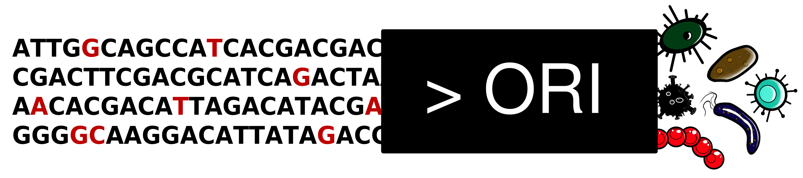

# 

**ORI example** : small example of how to create an index containing 25 *Streptococcus thermophilus* strains with merged of the sibling strains and queried with a fastq file containing 2 strains (*Streptococcus thermophilus* JIM8232 and CIRM67). 

ORI must be installed from conda first (see [wiki](https://github.com/gsiekaniec/ORI/wiki/ORI's-Home#installation)).

The commands to be launched are the following: 

```
cd index

touch seedfile.txt
echo "111111001111111" > seedfile.txt


#Index creation
ORI.py length -g . -o length.txt -s 15 -fpr 0.1
howdesbt makebfQ --k=15 --qgram=seedfile.txt --bits=0.02G *.fna
ls *.bf > leafname
#merge sibling strains
howdesbt distance --list=leafname
ORI.py threshold -n leafname -m hamming_matrix.tsv -t 0.0002
howdesbt distance --list=leafname --threshold=0.0002 --matrix=hamming_matrix.bin --merge
ORI.py clean_merge -n leafname -r . -o list_number_file.txt
ls *.bf > leafname_merge
ORI.py merge_length -b leafname_merge -l length.txt -c list_number_file.txt -o merge_length.txt
#
howdesbt cluster --list=leafname_merge --tree=union.sbt --nodename=node{number} --cull
howdesbt build --howde --tree=union.sbt --outtree=howde.sbt
ls | grep -Pv 'detbrief.rrr.' | grep '.bf' | xargs rm --
#

#Query part
ORI.py suppr_bad_reads -fq ../reads/2strains.fastq -q 9 -l 2000
head -n 16000 2strains_better_than_9.fastq > 2strains_4000_reads.fq
howdesbt queryQ --sort --qgram=seedfile.txt --tree=howde.sbt --threshold=0.5 2strains_4000_reads.fq > results_howde.txt
ORI.py matrix -f results_howde.txt -l leafname_merge -o matrix.tsv
#

#Identification part
ORI.py identification -m matrix.tsv -f results_howde.txt -le merge_length.txt -l leafname_merge -c $(which clingo) -o identification.ori
ORI.py beautiful_results -f identification.ori -n list_number_file.txt --pie_chart
#
```

A detailed explanation of this example is presented in the wiki [here](https://github.com/gsiekaniec/ORI/wiki/Example).

<p align="center" width="100%">
  <a href="https://github.com/gsiekaniec/ORI/wiki/Example">
    
  </a>
</p>
